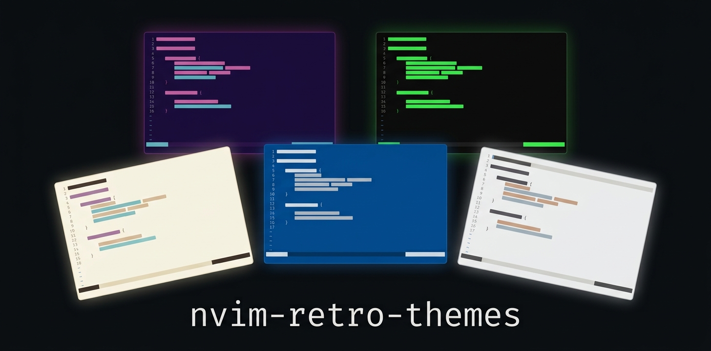
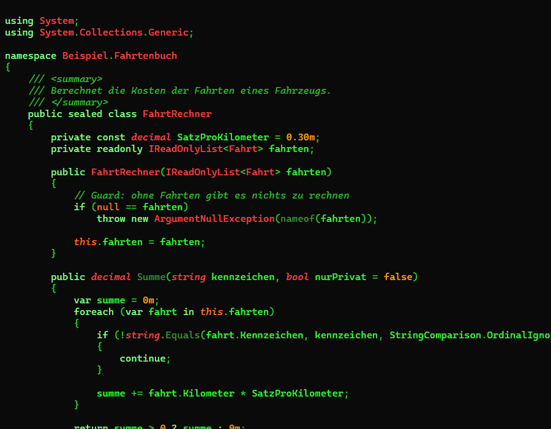

# nvim-retro-themes

<p align="center">
   <b>English</b> ·
   <a href="README.de.md">Deutsch</a>
</p>

---

<p align="center">
  
</p>

41 colorschemes for Neovim, 36 dark and 5 light, built from the retro palettes of
[textual-themes](https://github.com/michaelblaess/textual-themes) and tuned for reading code.

The colours are not copied one to one. A palette made for a TUI has small text fields, an editor
is one large text surface. Every colour here is therefore checked and lifted until it is readable,
and syntax colours that would look alike are pulled apart.


Synthwave on top, below it Classic Terminal and Clipper. **[See all 41 colorschemes](docs/vorschau.md)**




## Install

With `vim.pack` on Neovim 0.12:

```lua
vim.pack.add({ "https://github.com/michaelblaess/nvim-retro-themes" })
vim.cmd.colorscheme("retro-synthwave")
```

To try one without installing:

```
nvim --cmd "set rtp+=/path/to/nvim-retro-themes" file.cs
:colorscheme retro-boing
```

## What the schemes cover

Editor surface, floating windows, popup menu, status line, selection, search, folds and diffs.
Classic syntax groups and the Treesitter captures. Diagnostics. The plugins used in the author's
setup: render-markdown.nvim, mini.icons, mini.files, mini.pick and mini.clue. Terminal colours 0
to 15.

## The rules behind the colours

- **Readable first.** Text and syntax reach a contrast of at least 4.5:1 on every surface they
  can appear on, line numbers and borders at least 3:1. Hue and saturation stay, so a theme keeps
  its character.
- **The surface moves away from the text.** Some palettes sit too close to their own text for
  a full screen of it. A dark theme then gets darker, a light one lighter, until the body text
  reaches 8:1. That leaves room for six syntax colours. No colour is pushed past 13:1 either,
  otherwise the one that has to dodge ends up near black or near white.
- **Syntax colours stay apart**, from each other and from the body text. Where a palette uses
  one colour twice, the next candidate is taken, then a shift in lightness, then another colour
  of the same palette, then a shift in hue. Two syntax colours, and a syntax colour and the text,
  are always at least 22 apart in CIE76.

Every rule is covered by a test over all 41 themes.

## Generating

```
uv run python -m nvim_retro_themes            # write colors/
uv run python -m nvim_retro_themes --report   # contrast table only
```

The palettes in `src/nvim_retro_themes/data/` are a snapshot taken from textual-themes 0.14.0.
`tools/snapshot_from_textual.py` refreshes it and overwrites changes made by hand.

One theme is different: `christophorus` has no eleven base colours of its own. Its roles from
web-themes were mapped onto them by hand, the mapping is recorded in its data file. The snapshot
tool only writes the themes it finds in textual-themes, so that file stays untouched.

## Liability

These colorschemes are a hobby project and come without any warranty, exactly as the Apache-2.0
licence describes. They change how the editor looks, nothing else. Use them at your own risk.

## Trade marks and names

The theme names come from [textual-themes](https://github.com/michaelblaess/textual-themes) and
allude to machines, desktops and films that mean something to me. They name colour palettes, not
anyone else's products, and there is no connection to their owners. Any trade marks mentioned
belong to their respective owners.

## Licence

Apache-2.0.
